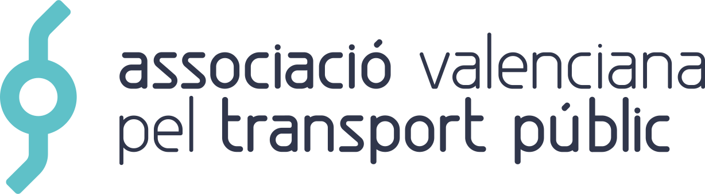

<p align="center"></p>

# Blog


## About

This project extends [Ghost](https://ghost.org), the blogging platform, to fit the needs of [Associació Valenciana pel Transport Públic](https://avptp.org) (Valencian Association for Public Transport), a non-profit organization whose goal is to achieve the public transport that the [Valencian society](https://en.wikipedia.org/wiki/Valencian_Community) deserves.

### Practices and principles

The development workflow is based on these practices and principles:

* [Gitflow](https://www.atlassian.com/git/tutorials/comparing-workflows/gitflow-workflow).
* [Semantic Versioning](https://semver.org).

### Directory structure

The project follows the structure below:

* `Dockerfile`, `docker-compose.yml`, and `.dockerignore` have all necessary [Docker](https://www.docker.com) manifests to define the development and runtime environments.
* `chart` contains a [Helm](https://helm.sh) package with all [Kubernetes](https://kubernetes.io) specifications that define the infrastructure.
* `.drone.yml` has the [Drone](https://drone.io) CI/CD pipeline.
* `resources` contains media assets.

### License

This software is distributed under the MIT license. Please read [the software license](license.md) and [the resources license](resources/license.md) for more information on the availability and distribution.

## First steps

The project comes with a fully functional [Docker](https://www.docker.com) environment that has everything necessary to develop on any platform.

### Installation

The only software requirements are [Docker Engine](https://docs.docker.com/engine/installation/) (Community Edition) and [Docker Compose](https://docs.docker.com/compose/install/). Follow the previous links to read the installation instructions. It is necessary to install the latest versions before continuing.

#### Environment file

Once installed, copy the example environment file to its default location.

```Shell
cp .env.example .env
```

Then, complete the `UID` environment variable with your user ID (`id -u`). Thus, the application container will use your user to interact with shared volumes.

```Shell
sed -i "s/UID=.*/UID=$(id -u)/" .env
```

#### Docker environment

The development environment is made of a single container:

* `app` runs the application itself with [Ghost](https://ghost.org).

To build the environment, run Docker Compose in daemon mode. The first time it may take a few minutes, since containers must be built.

```Shell
docker-compose up -d
```

Then, enter to the `app` container.

```Shell
docker-compose exec -u $(id -u) app bash
```

To easily access the container on subsequent occasions, you can add the following alias to your `.bashrc` or `.zshrc` file.

```Shell
alias app="docker-compose exec -u $(id -u) app bash"
```

### Usage

Once the container is started, it is possible to start using the software.

> Note that Git is not available in the container, so you should use it from the host machine. It is strongly recommended to use a desktop client like [Fork](https://git-fork.com) or [GitKraken](https://www.gitkraken.com).

### Deployment

The deployment process is automated with [Drone](https://drone.io) and [Kubernetes](https://kubernetes.io). When changes are incorporated into production (`master` branch) or staging (`develop` branch), an automatic deployment is made to the corresponding environment.

## Workflow

When working on a task, its branch should be created if it does not exist. When work is finished on a branch, it must be checked that all changes have been **documented**. It must also be checked that **code style** meets the standards and all **tests** pass.

Note that the following conditions must be met before creating a pull request:

* All model and code changes must be documented.
* Code style must comply the standards.
* All tests must pass.

## Troubleshooting

There are several common problems that can be easily solved. Here are their causes and solutions.

### Docker

The Docker environment should work properly as it has been exhaustively tested. Otherwise, it is possible to rebuild it by running the following command.

```Shell
docker-compose build --no-cache
```

You can also rebuild a single service. For example, if you want to rebuild the `app` service:

```Shell
docker-compose build --no-cache app
```

To start from scratch, you can remove all containers, images and volumes of your computer by running the following commands.

> Note that all system containers, images and volumes will be deleted, not only those related to this project.

```Shell
docker-compose down
docker rm $(docker ps -a -q)
docker rmi $(docker images -q)
docker volume rm $(docker volume ls -f dangling=true -q)
```
